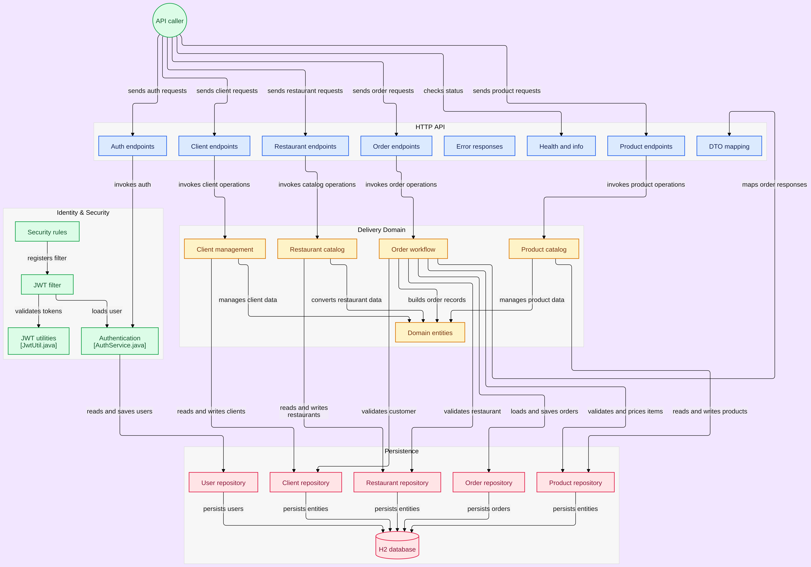

# Delivery Tech API

Sistema de delivery completo desenvolvido com Spring Boot e Java 21 LTS.

---

## 🚀 Tecnologias
- **Java 21 LTS**
- **Spring Boot 3.2.x**
- **Spring Web (MVC)**
- **Spring Data JPA & Hibernate**
- **Spring Security & JWT (JSON Web Token)**
- **SpringDoc OpenAPI 3 (Swagger UI)**
- **Lombok**
- **H2 Database (Banco em memória)**
- **Maven**

---

## 🏃‍♂️ Como Executar e Compilar (Build)

### 1. Modo Desenvolvimento (Executar direto via Maven)
Para subir a aplicação rapidamente durante o desenvolvimento com hot-reload (DevTools):
```bash
./mvnw spring-boot:run
```

---

### 2. Como Fazer o Build (Gerar o pacote `.jar`)
Para compilar o projeto e gerar o arquivo executável independente (JAR):

```bash
# Build completo (executando os testes):
./mvnw clean package

# Build rápido (pulando a execução de testes):
./mvnw clean package -DskipTests
```

> 📦 **Onde o arquivo é gerado:**  
> O pacote executável será salvo na pasta `target`:  
> `target/delivery-api-0.0.1-SNAPSHOT.jar`

---

### 3. Como Executar o JAR Gerado (Modo Produção)
Após fazer o build, você pode rodar a aplicação em qualquer servidor que tenha o Java 21 instalado, sem precisar do Maven:

```bash
java -jar target/delivery-api-0.0.1-SNAPSHOT.jar
```

#### Passando parâmetros ou porta personalizada:
```bash
java -jar target/delivery-api-0.0.1-SNAPSHOT.jar --server.port=8080
```

#### Passando variáveis de ambiente (ex: JWT Secret):
```bash
JWT_SECRET="minhaChaveSuperSecreta" java -jar target/delivery-api-0.0.1-SNAPSHOT.jar
```

---

## 🔗 Links Úteis da Aplicação Rodando
* **Swagger UI (Documentação Interativa):** [http://localhost:8080/swagger-ui/index.html](http://localhost:8080/swagger-ui/index.html)
* **Especificação OpenAPI JSON:** [http://localhost:8080/v3/api-docs](http://localhost:8080/v3/api-docs)
* **Health Check:** [http://localhost:8080/health](http://localhost:8080/health)
* **Informações da Aplicação:** [http://localhost:8080/info](http://localhost:8080/info)
* **Console H2 Database:** [http://localhost:8080/h2-console](http://localhost:8080/h2-console)
  * **JDBC URL:** `jdbc:h2:mem:deliverydb`
  * **User Name:** `sa`
  * **Password:** *(em branco)*

---

## 🧪 Testes Automatizados

### Executar os testes unitários:
```bash
./mvnw clean test -Djacoco.skip=true
```

### Relatório de Cobertura JaCoCo:
```bash
target/site/jacoco/index.html
```

---

## 📋 Rotas da API Disponíveis

| Módulo | Método | Endpoint | Descrição | Autenticação |
| :--- | :--- | :--- | :--- | :--- |
| **Auth** | `POST` | `/api/auth/register` | Cadastrar novo usuário (ADMIN, CLIENTE, etc.) | Pública |
| | `POST` | `/api/auth/login` | Autenticar e obter token JWT | Pública |
| **Clientes** | `POST` | `/api/clientes` | Cadastrar novo cliente | Bearer JWT |
| | `GET` | `/api/clientes` | Listar clientes ativos | Bearer JWT |
| | `GET` | `/api/clientes/{id}` | Buscar cliente por ID | Bearer JWT |
| | `GET` | `/api/clientes/email/{email}` | Buscar cliente por e-mail | Bearer JWT |
| | `PUT` | `/api/clientes/{id}` | Atualizar cliente | Bearer JWT |
| | `PATCH` | `/api/clientes/{id}/status` | Alternar status ativo/inativo | Bearer JWT |
| **Restaurantes** | `POST` | `/api/restaurantes` | Cadastrar novo restaurante | Bearer JWT |
| | `GET` | `/api/restaurantes` | Listar com paginação e filtros | Pública |
| | `GET` | `/api/restaurantes/{id}` | Buscar restaurante por ID | Pública |
| | `PUT` | `/api/restaurantes/{id}` | Atualizar restaurante | Bearer JWT |
| | `PATCH` | `/api/restaurantes/{id}/status` | Alternar status ativo/inativo | Bearer JWT |
| | `GET` | `/api/restaurantes/categoria/{cat}` | Buscar por categoria | Pública |
| | `GET` | `/api/restaurantes/{id}/taxa-entrega`| Calcular taxa de entrega por CEP | Pública |
| | `GET` | `/api/restaurantes/proximos` | Buscar restaurantes por raio (km) | Pública |
| | `GET` | `/api/restaurantes/avaliacao` | Buscar por avaliação mínima | Pública |
| **Produtos** | `POST` | `/api/produtos` | Cadastrar novo produto | Bearer JWT |
| | `GET` | `/api/produtos/{id}` | Buscar produto por ID | Pública |
| | `PUT` | `/api/produtos/{id}` | Atualizar produto | Bearer JWT |
| | `DELETE`| `/api/produtos/{id}` | Remover produto | Bearer JWT |
| | `PATCH` | `/api/produtos/{id}/disponibilidade`| Alternar disponibilidade | Bearer JWT |
| | `GET` | `/api/produtos/categoria/{cat}` | Buscar produtos por categoria | Pública |
| | `GET` | `/api/produtos/buscar?nome=...` | Buscar por nome | Pública |
| | `GET` | `/api/produtos/restaurante/{id}` | Buscar produtos do restaurante | Pública |
| **Pedidos** | `POST` | `/api/pedidos` | Criar novo pedido | Bearer JWT |
| | `POST` | `/api/pedidos/calcular` | Simular total de itens antes de fechar | Bearer JWT |
| | `GET` | `/api/pedidos/{id}` | Buscar pedido por ID | Bearer JWT |
| | `GET` | `/api/pedidos/cliente/{id}` | Listar pedidos do cliente | Bearer JWT |
| | `GET` | `/api/pedidos/restaurante/{id}` | Listar pedidos do restaurante | Bearer JWT |
| | `GET` | `/api/pedidos` | Listar todos os pedidos (paginado) | Bearer JWT |
| | `PATCH` | `/api/pedidos/{id}/status` | Atualizar status do pedido | Bearer JWT |
| | `DELETE`| `/api/pedidos/{id}` | Cancelar pedido | Bearer JWT |
| **Saúde** | `GET` | `/health` | Status UP e versão do Java | Pública |
| | `GET` | `/info` | Metadados e versão da aplicação | Pública |

---

## 📚 Guia de Estudos e Conceitos da Aplicação

---

### 1. 🔑 Autenticação e Testes com Token no Swagger UI

1. **Obter o Token:**
   - Faça uma requisição em `POST /api/auth/register` (se ainda não tiver usuário) e depois em `POST /api/auth/login`.
   - Copie o valor do atributo `"token"` retornado no JSON.
2. **Autorizar no Swagger:**
   - No topo da página do Swagger UI, clique no botão verde **`Authorize`** 🔓.
   - Cole o token no campo de texto *(não precisa digitar `Bearer `, apenas cole o token)*.
   - Clique em **Authorize** e feche a janela. O cadeado ficará fechado 🔒.
3. **Testar:**
   - Agora todas as rotas protegidas executarão incluindo o cabeçalho `Authorization: Bearer <seu-token>`.
   - Para comprovar que a segurança funciona: clique em **Authorize** -> **Logout** e tente chamar uma rota protegida (retornará `403 Forbidden` ou `401 Unauthorized`).

---

### 2. 📝 Como são gerados e onde definir os Schemas no Swagger?

* **Geração Automática:** O SpringDoc inspeciona os `@RestController`. Sempre que uma classe é usada no `@RequestBody` ou no retorno (`ResponseEntity<T>`), o Swagger gera o Schema automaticamente na aba **Schemas**.
* **Onde Definir:** Diretamente nos **DTOs** utilizando anotações:
  - `@Schema(description = "...", example = "...")`: adiciona textos explicativos e exemplos pré-preenchidos no Swagger.
  - Anotações do `jakarta.validation` (`@NotBlank`, `@NotNull`, `@Size`, `@Email`, `@Min`, `@Max`, `@Pattern`): são lidas automaticamente pelo Swagger, que adiciona asterisco vermelho `*` para campos obrigatórios, limites e formatos.

---

### 3. ⚡ Lombok Explicado de Forma Simples

O Lombok elimina código boilerplate repetitivo através de anotações em tempo de compilação:

* **`@Data` (O Combo 5 em 1):**
  Gera automaticamente:
  - Todos os *Getters* (`getNome()`)
  - Todos os *Setters* (`setNome()`)
  - `toString()` legível (ex: `Usuario(nome=Matheus)` em vez de `Usuario@4a5b`)
  - `equals()` e `hashCode()` (para comparar objetos pelo conteúdo)
* **`@NoArgsConstructor` (Construtor Vazio):**
  - Cria: `public Usuario() {}`
  - **Por que é obrigatório no Spring?** O **Jackson** (que converte JSON para Java) e o **Hibernate** (que busca do banco) exigem o construtor vazio para instanciar o objeto antes de preencher os atributos.
* **`@AllArgsConstructor` (Construtor Cheio):**
  - Cria: `public Usuario(String nome, String email, ...)`
  - Permite instanciar objetos rapidamente no código ou nos testes unitários em uma única linha.
* **A Pegadinha:** No Java, criar qualquer construtor com argumentos apaga o construtor vazio padrão. Por isso, a dupla **`@NoArgsConstructor` + `@AllArgsConstructor`** é usada junta para que tanto você quanto o Spring/Jackson tenham seus construtores disponíveis!

---

### 4. 📦 Por que usar `Optional<T>` nos Repositories?

Exemplo: `Optional<Restaurante> findByNome(String nome);`

* **A Analogia da Caixa:** O `Optional` é como uma caixa que pode conter o objeto ou vir vazia (`null`).
* **Evita o `NullPointerException`:** Se uma busca não encontrar o registro, em vez de retornar `null` (que causaria erro grave se alguém chamasse `restaurante.getTelefone()`), o Java te força a tratar a ausência com métodos seguros:
  ```java
  // 1. Verificar se já existe:
  if (repo.findByNome("Nome").isPresent()) { ... }

  // 2. Buscar ou lançar erro 404:
  Restaurante r = repo.findByNome("Nome")
      .orElseThrow(() -> new EntityNotFoundException("Restaurante não encontrado"));
  ```
* **Diferença para `List`:** Métodos que retornam listas (ex: `List<Restaurante>`) não precisam de `Optional`, pois uma lista nunca precisa ser `null` — quando não há resultados, ela simplesmente volta vazia `[]` com tamanho zero.

---

### 5. 🔄 Gerenciamento de Transações (`@Transactional`)

Controla o ciclo de vida das transações com o banco (sucesso = `COMMIT`, erro = `ROLLBACK`).

#### `readOnly = true` em Consultas:
Ao anotar métodos de leitura (`buscar`, `listar`):
```java
@Transactional(readOnly = true)
```
1. **Desativa o Dirty Checking:** O Hibernate para de verificar se os dados em memória mudaram, economizando muita CPU e memória RAM.
2. **Segurança:** Evita alterações acidentais no banco durante uma leitura.
3. **Réplicas de Leitura:** Em produção, permite que o Spring envie o SELECT diretamente para réplicas de leitura (*read replicas*), aliviando o banco principal.

#### Outros Parâmetros Importantes:
* **`rollbackFor = Exception.class`**: Por padrão, o Spring só faz rollback para erros não-checados (`RuntimeException`). Usando `rollbackFor = Exception.class`, você garante rollback para qualquer tipo de exceção.
* **`propagation` (Propagação)**:
  - `REQUIRED` *(Padrão)*: Se já houver transação aberta, entra nela; se não, cria uma nova.
  - `REQUIRES_NEW`: Cria sempre uma nova transação independente (ótimo para logs de auditoria que devem ser gravados mesmo se a transação principal falhar e fizer rollback).
* **`timeout = 5`**: Cancela a operação e faz rollback se a consulta demorar mais que o tempo estipulado em segundos.
* **`isolation`**: Define o nível de concorrência e isolamento entre transações simultâneas (ex: `READ_COMMITTED` para evitar leituras sujas).

---

### 6. 🏗️ Padrão de Projeto: Interfaces e Pasta `impl`
* **Contrato vs Implementação**: A Interface (ex: `ClienteService`) define **o que** o sistema faz. A classe na pasta `impl` (`ClienteServiceImpl`) define **como** é feito.
* Facilita testes com mocks, reduz acoplamento e padroniza a arquitetura em projetos corporativos.

---

### 7. 🏷️ Auditoria de Datas: `@PrePersist` e Alternativas

#### O que é o `@PrePersist`?
Executa um método de callback automaticamente no momento exato antes de salvar a entidade pela primeira vez no banco (INSERT):
```java
@PrePersist
public void prePersist() {
    this.dataCadastro = LocalDateTime.now();
}
```

---

#### 🔄 Outras Opções Além do `@PrePersist`:

1. **Anotações do Hibernate (`@CreationTimestamp` e `@UpdateTimestamp`) — *Mais Popular*:**
   Não precisa de método algum, basta anotar o próprio campo:
   ```java
   @CreationTimestamp
   @Column(nullable = false, updatable = false)
   private LocalDateTime dataCadastro;

   @UpdateTimestamp
   private LocalDateTime dataAtualizacao; // atualiza a cada UPDATE
   ```

2. **Valor Padrão no Atributo Java — *Mais Simples*:**
   Inicializa o campo na criação do objeto em memória:
   ```java
   @Column(name = "data_criacao", nullable = false)
   private LocalDateTime dataCriacao = LocalDateTime.now();
   ```

3. **Spring Data JPA Auditing — *Padrão Corporativo*:**
   Habilita auditoria com `@EnableJpaAuditing` e anota a entidade com `@EntityListeners(AuditingEntityListener.class)`. Permite registrar data e quem fez a alteração:
   ```java
   @CreatedDate
   @Column(updatable = false)
   private LocalDateTime dataCadastro;

   @LastModifiedDate
   private LocalDateTime dataAtualizacao;

   @CreatedBy
   private String criadoPor; // usuário autenticado no Spring Security
   ```

4. **Direto no Banco de Dados (SQL `DEFAULT`) — *Nível Banco*:**
   A responsabilidade da data fica a cargo do motor do banco (Postgres/MySQL/H2):
   ```java
   @Column(insertable = false, columnDefinition = "TIMESTAMP DEFAULT CURRENT_TIMESTAMP")
   private LocalDateTime dataCadastro;
   ```
💡 Qual escolher no dia a dia?
Quer praticidade e código limpo? ➔ Opção 1 (@CreationTimestamp)
Quer registrar apenas no objeto sem anotações extras? ➔ Opção 2 (= LocalDateTime.now())
Precisa de auditoria completa com usuário que criou/editou? ➔ Opção 3 (Spring Data Auditing)
---
# Diagrama 1.0 da API

