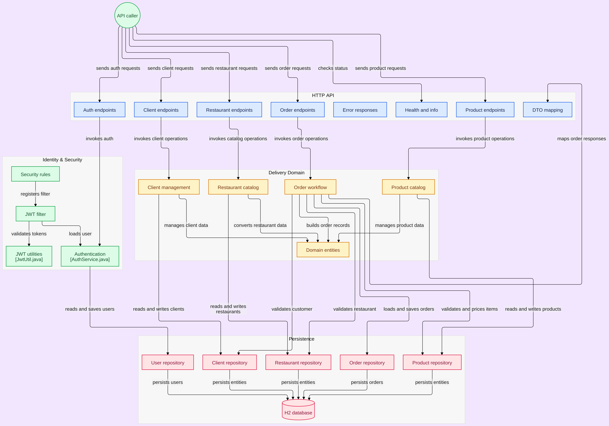

# Delivery Tech API

Sistema de delivery completo desenvolvido com Spring Boot e Java 21 LTS.

---

## 🚀 Tecnologias

- **Java 21 LTS**
- **Spring Boot 3.2.x**
- **Spring Web (MVC)**
- **Spring Data JPA & Hibernate**
- **Spring Security & JWT (JSON Web Token)**
- **SpringDoc OpenAPI 3 (Swagger UI)**
- **Lombok**
- **H2 Database (Banco em memória)**
- **Redis (Cache distribuído em memória)**
- **Maven**

---

## 🏃‍♂️ Como Executar e Compilar (Build)

### 1. Modo Desenvolvimento (Executar direto via Maven)

Para subir a aplicação rapidamente durante o desenvolvimento com hot-reload (DevTools):

```bash
./mvnw spring-boot:run
```

---

### 2. Como Fazer o Build (Gerar o pacote `.jar`)

Para compilar o projeto e gerar o arquivo executável independente (JAR):

```bash
# Build completo (executando os testes):
./mvnw clean package

# Build rápido (pulando a execução de testes):
./mvnw clean package -DskipTests
```

> 📦 **Onde o arquivo é gerado:**  
> O pacote executável será salvo na pasta `target`:  
> `target/delivery-api-0.0.1-SNAPSHOT.jar`

---

### 3. Como Executar o JAR Gerado (Modo Produção)

Após fazer o build, você pode rodar a aplicação em qualquer servidor que tenha o Java 21 instalado, sem precisar do Maven:

```bash
java -jar target/delivery-api-0.0.1-SNAPSHOT.jar
```

#### Passando parâmetros ou porta personalizada:

```bash
java -jar target/delivery-api-0.0.1-SNAPSHOT.jar --server.port=8080
```

#### Passando variáveis de ambiente (ex: JWT Secret):

```bash
JWT_SECRET="minhaChaveSuperSecreta" java -jar target/delivery-api-0.0.1-SNAPSHOT.jar
```

---

### 4. Modo Docker & Observabilidade (API + Prometheus + Grafana + Zipkin + Nginx)

Para subir o ecossistema completo de 5 containers com 1 único comando usando **Docker Compose**:

```bash
# 1. Compilar o JAR da API:
./mvnw clean package -DskipTests

# 2. Subir API, Nginx, Prometheus, Grafana e Zipkin em segundo plano:
docker compose up -d --build

# Para ver os logs em tempo real:
docker compose logs -f

# Para parar todos os containers:
docker compose down
```

---

## 🔗 Links Úteis da Aplicação Rodando

- **API via Nginx (Porta 80 - Padrão Web sem porta!):** [http://localhost/swagger-ui/index.html](http://localhost/swagger-ui/index.html)
- **API Direta (Swagger UI):** [http://localhost:8080/swagger-ui/index.html](http://localhost:8080/swagger-ui/index.html)
- **Especificação OpenAPI JSON:** [http://localhost:8080/v3/api-docs](http://localhost:8080/v3/api-docs)
- **Health Check Geral:** [http://localhost:8080/actuator/health](http://localhost:8080/actuator/health)
- **Métricas Prometheus:** [http://localhost:8080/actuator/prometheus](http://localhost:8080/actuator/prometheus)
- **Prometheus Dashboard:** [http://localhost:9090](http://localhost:9090)
- **Grafana (Painéis e Gráficos):** [http://localhost:3000](http://localhost:3000) _(usuário: `admin`, senha: `admin`)_
- **Zipkin (Distributed Tracing / Linha do Tempo):** [http://localhost:9411](http://localhost:9411)
- **Console H2 Database:** [http://localhost:8080/h2-console](http://localhost:8080/h2-console)
  - **JDBC URL:** `jdbc:h2:mem:deliverydb`
  - **User Name:** `sa`
  - **Password:** _(em branco)_

---

## 🧪 Testes Automatizados

### Executar os testes unitários:

```bash
./mvnw clean test -Djacoco.skip=true
```

### Relatório de Cobertura JaCoCo:

```bash
target/site/jacoco/index.html
```

---

## 📋 Rotas da API Disponíveis

| Módulo           | Método   | Endpoint                              | Descrição                                     | Autenticação |
| :--------------- | :------- | :------------------------------------ | :-------------------------------------------- | :----------- |
| **Auth**         | `POST`   | `/api/auth/register`                  | Cadastrar novo usuário (ADMIN, CLIENTE, etc.) | Pública      |
|                  | `POST`   | `/api/auth/login`                     | Autenticar e obter token JWT                  | Pública      |
| **Clientes**     | `POST`   | `/api/clientes`                       | Cadastrar novo cliente                        | Bearer JWT   |
|                  | `GET`    | `/api/clientes`                       | Listar clientes ativos                        | Bearer JWT   |
|                  | `GET`    | `/api/clientes/{id}`                  | Buscar cliente por ID                         | Bearer JWT   |
|                  | `GET`    | `/api/clientes/email/{email}`         | Buscar cliente por e-mail                     | Bearer JWT   |
|                  | `PUT`    | `/api/clientes/{id}`                  | Atualizar cliente                             | Bearer JWT   |
|                  | `PATCH`  | `/api/clientes/{id}/status`           | Alternar status ativo/inativo                 | Bearer JWT   |
| **Restaurantes** | `POST`   | `/api/restaurantes`                   | Cadastrar novo restaurante                    | Bearer JWT   |
|                  | `GET`    | `/api/restaurantes`                   | Listar com paginação e filtros                | Pública      |
|                  | `GET`    | `/api/restaurantes/{id}`              | Buscar restaurante por ID                     | Pública      |
|                  | `PUT`    | `/api/restaurantes/{id}`              | Atualizar restaurante                         | Bearer JWT   |
|                  | `PATCH`  | `/api/restaurantes/{id}/status`       | Alternar status ativo/inativo                 | Bearer JWT   |
|                  | `GET`    | `/api/restaurantes/categoria/{cat}`   | Buscar por categoria                          | Pública      |
|                  | `GET`    | `/api/restaurantes/{id}/taxa-entrega` | Calcular taxa de entrega por CEP              | Pública      |
|                  | `GET`    | `/api/restaurantes/proximos`          | Buscar restaurantes por raio (km)             | Pública      |
|                  | `GET`    | `/api/restaurantes/avaliacao`         | Buscar por avaliação mínima                   | Pública      |
| **Produtos**     | `POST`   | `/api/produtos`                       | Cadastrar novo produto                        | Bearer JWT   |
|                  | `GET`    | `/api/produtos/{id}`                  | Buscar produto por ID                         | Pública      |
|                  | `PUT`    | `/api/produtos/{id}`                  | Atualizar produto                             | Bearer JWT   |
|                  | `DELETE` | `/api/produtos/{id}`                  | Remover produto                               | Bearer JWT   |
|                  | `PATCH`  | `/api/produtos/{id}/disponibilidade`  | Alternar disponibilidade                      | Bearer JWT   |
|                  | `GET`    | `/api/produtos/categoria/{cat}`       | Buscar produtos por categoria                 | Pública      |
|                  | `GET`    | `/api/produtos/buscar?nome=...`       | Buscar por nome                               | Pública      |
|                  | `GET`    | `/api/produtos/restaurante/{id}`      | Buscar produtos do restaurante                | Pública      |
| **Pedidos**      | `POST`   | `/api/pedidos`                        | Criar novo pedido                             | Bearer JWT   |
|                  | `POST`   | `/api/pedidos/calcular`               | Simular total de itens antes de fechar        | Bearer JWT   |
|                  | `GET`    | `/api/pedidos/{id}`                   | Buscar pedido por ID                          | Bearer JWT   |
|                  | `GET`    | `/api/pedidos/cliente/{id}`           | Listar pedidos do cliente                     | Bearer JWT   |
|                  | `GET`    | `/api/pedidos/restaurante/{id}`       | Listar pedidos do restaurante                 | Bearer JWT   |
|                  | `GET`    | `/api/pedidos`                        | Listar todos os pedidos (paginado)            | Bearer JWT   |
|                  | `PATCH`  | `/api/pedidos/{id}/status`            | Atualizar status do pedido                    | Bearer JWT   |
|                  | `DELETE` | `/api/pedidos/{id}`                   | Cancelar pedido                               | Bearer JWT   |
| **Saúde**        | `GET`    | `/health`                             | Status UP e versão do Java                    | Pública      |
|                  | `GET`    | `/info`                               | Metadados e versão da aplicação               | Pública      |

---

## 📚 Guia de Estudos e Conceitos da Aplicação

---

### 1. 🔑 Autenticação e Testes com Token no Swagger UI

1. **Obter o Token:**
   - Faça uma requisição em `POST /api/auth/register` (se ainda não tiver usuário) e depois em `POST /api/auth/login`.
   - Copie o valor do atributo `"token"` retornado no JSON.
2. **Autorizar no Swagger:**
   - No topo da página do Swagger UI, clique no botão verde **`Authorize`** 🔓.
   - Cole o token no campo de texto _(não precisa digitar `Bearer `, apenas cole o token)_.
   - Clique em **Authorize** e feche a janela. O cadeado ficará fechado 🔒.
3. **Testar:**
   - Agora todas as rotas protegidas executarão incluindo o cabeçalho `Authorization: Bearer <seu-token>`.
   - Para comprovar que a segurança funciona: clique em **Authorize** -> **Logout** e tente chamar uma rota protegida (retornará `403 Forbidden` ou `401 Unauthorized`).

---

### 2. 📝 Como são gerados e onde definir os Schemas no Swagger?

- **Geração Automática:** O SpringDoc inspeciona os `@RestController`. Sempre que uma classe é usada no `@RequestBody` ou no retorno (`ResponseEntity<T>`), o Swagger gera o Schema automaticamente na aba **Schemas**.
- **Onde Definir:** Diretamente nos **DTOs** utilizando anotações:
  - `@Schema(description = "...", example = "...")`: adiciona textos explicativos e exemplos pré-preenchidos no Swagger.
  - Anotações do `jakarta.validation` (`@NotBlank`, `@NotNull`, `@Size`, `@Email`, `@Min`, `@Max`, `@Pattern`): são lidas automaticamente pelo Swagger, que adiciona asterisco vermelho `*` para campos obrigatórios, limites e formatos.

---

### 3. ⚡ Lombok Explicado de Forma Simples

O Lombok elimina código boilerplate repetitivo através de anotações em tempo de compilação:

- **`@Data` (O Combo 5 em 1):**
  Gera automaticamente:
  - Todos os _Getters_ (`getNome()`)
  - Todos os _Setters_ (`setNome()`)
  - `toString()` legível (ex: `Usuario(nome=Matheus)` em vez de `Usuario@4a5b`)
  - `equals()` e `hashCode()` (para comparar objetos pelo conteúdo)
- **`@NoArgsConstructor` (Construtor Vazio):**
  - Cria: `public Usuario() {}`
  - **Por que é obrigatório no Spring?** O **Jackson** (que converte JSON para Java) e o **Hibernate** (que busca do banco) exigem o construtor vazio para instanciar o objeto antes de preencher os atributos.
- **`@AllArgsConstructor` (Construtor Cheio):**
  - Cria: `public Usuario(String nome, String email, ...)`
  - Permite instanciar objetos rapidamente no código ou nos testes unitários em uma única linha.
- **A Pegadinha:** No Java, criar qualquer construtor com argumentos apaga o construtor vazio padrão. Por isso, a dupla **`@NoArgsConstructor` + `@AllArgsConstructor`** é usada junta para que tanto você quanto o Spring/Jackson tenham seus construtores disponíveis!

---

### 4. 📦 Por que usar `Optional<T>` nos Repositories?

Exemplo: `Optional<Restaurante> findByNome(String nome);`

- **A Analogia da Caixa:** O `Optional` é como uma caixa que pode conter o objeto ou vir vazia (`null`).
- **Evita o `NullPointerException`:** Se uma busca não encontrar o registro, em vez de retornar `null` (que causaria erro grave se alguém chamasse `restaurante.getTelefone()`), o Java te força a tratar a ausência com métodos seguros:

  ```java
  // 1. Verificar se já existe:
  if (repo.findByNome("Nome").isPresent()) { ... }

  // 2. Buscar ou lançar erro 404:
  Restaurante r = repo.findByNome("Nome")
      .orElseThrow(() -> new EntityNotFoundException("Restaurante não encontrado"));
  ```

- **Diferença para `List`:** Métodos que retornam listas (ex: `List<Restaurante>`) não precisam de `Optional`, pois uma lista nunca precisa ser `null` — quando não há resultados, ela simplesmente volta vazia `[]` com tamanho zero.

---

### 5. 🔄 Gerenciamento de Transações (`@Transactional`)

Controla o ciclo de vida das transações com o banco (sucesso = `COMMIT`, erro = `ROLLBACK`).

#### `readOnly = true` em Consultas:

Ao anotar métodos de leitura (`buscar`, `listar`):

```java
@Transactional(readOnly = true)
```

1. **Desativa o Dirty Checking:** O Hibernate para de verificar se os dados em memória mudaram, economizando muita CPU e memória RAM.
2. **Segurança:** Evita alterações acidentais no banco durante uma leitura.
3. **Réplicas de Leitura:** Em produção, permite que o Spring envie o SELECT diretamente para réplicas de leitura (_read replicas_), aliviando o banco principal.

#### Outros Parâmetros Importantes:

- **`rollbackFor = Exception.class`**: Por padrão, o Spring só faz rollback para erros não-checados (`RuntimeException`). Usando `rollbackFor = Exception.class`, você garante rollback para qualquer tipo de exceção.
- **`propagation` (Propagação)**:
  - `REQUIRED` _(Padrão)_: Se já houver transação aberta, entra nela; se não, cria uma nova.
  - `REQUIRES_NEW`: Cria sempre uma nova transação independente (ótimo para logs de auditoria que devem ser gravados mesmo se a transação principal falhar e fizer rollback).
- **`timeout = 5`**: Cancela a operação e faz rollback se a consulta demorar mais que o tempo estipulado em segundos.
- **`isolation`**: Define o nível de concorrência e isolamento entre transações simultâneas (ex: `READ_COMMITTED` para evitar leituras sujas).

---

### 6. 🏗️ Padrão de Projeto: Interfaces e Pasta `impl`

- **Contrato vs Implementação**: A Interface (ex: `ClienteService`) define **o que** o sistema faz. A classe na pasta `impl` (`ClienteServiceImpl`) define **como** é feito.
- Facilita testes com mocks, reduz acoplamento e padroniza a arquitetura em projetos corporativos.

---

### 7. 🏷️ Auditoria de Datas: `@PrePersist` e Alternativas

#### O que é o `@PrePersist`?

Executa um método de callback automaticamente no momento exato antes de salvar a entidade pela primeira vez no banco (INSERT):

```java
@PrePersist
public void prePersist() {
    this.dataCadastro = LocalDateTime.now();
}
```

---

#### 🔄 Outras Opções Além do `@PrePersist`:

1. **Anotações do Hibernate (`@CreationTimestamp` e `@UpdateTimestamp`) — _Mais Popular_:**
   Não precisa de método algum, basta anotar o próprio campo:

   ```java
   @CreationTimestamp
   @Column(nullable = false, updatable = false)
   private LocalDateTime dataCadastro;

   @UpdateTimestamp
   private LocalDateTime dataAtualizacao; // atualiza a cada UPDATE
   ```

2. **Valor Padrão no Atributo Java — _Mais Simples_:**
   Inicializa o campo na criação do objeto em memória:

   ```java
   @Column(name = "data_criacao", nullable = false)
   private LocalDateTime dataCriacao = LocalDateTime.now();
   ```

3. **Spring Data JPA Auditing — _Padrão Corporativo_:**
   Habilita auditoria com `@EnableJpaAuditing` e anota a entidade com `@EntityListeners(AuditingEntityListener.class)`. Permite registrar data e quem fez a alteração:

   ```java
   @CreatedDate
   @Column(updatable = false)
   private LocalDateTime dataCadastro;

   @LastModifiedDate
   private LocalDateTime dataAtualizacao;

   @CreatedBy
   private String criadoPor; // usuário autenticado no Spring Security
   ```

4. **Direto no Banco de Dados (SQL `DEFAULT`) — _Nível Banco_:**
   A responsabilidade da data fica a cargo do motor do banco (Postgres/MySQL/H2):
   ```java
   @Column(insertable = false, columnDefinition = "TIMESTAMP DEFAULT CURRENT_TIMESTAMP")
   private LocalDateTime dataCadastro;
   ```
5. 💡 Qual escolher no dia a dia?

Quer praticidade e código limpo? ➔ Opção 1 (@CreationTimestamp)
Quer registrar apenas no objeto sem anotações extras? ➔ Opção 2 (= LocalDateTime.now())
Precisa de auditoria completa com usuário que criou/editou? ➔ Opção 3 (Spring Data Auditing)

---

### 8. 🐳 Docker, Docker Compose e Observabilidade

#### Regra de Ouro das Portas (`FORA : DENTRO`)

```text
           -p 3000:3000
                ▲    ▲
                │    └── Porta interna onde o programa escuta (dentro do container)
                └─────── Porta externa no seu computador/navegador (localhost:3000)
```

#### Como os Containers Conversam Entre Si

- **Nunca use `localhost`** para falar de um container com outro (dentro de um container, `localhost` aponta para ele mesmo).
- Na mesma rede do `docker-compose`, **eles conversam usando o NOME DO SERVIÇO e a PORTA INTERNA**:
  - Ex: Para o Prometheus coletar da API: `http://delivery-api:8080/actuator/prometheus`.
  - Ex: Para o Grafana consultar o Prometheus: `http://prometheus:9090`.

#### Arquitetura de Produção e Observabilidade Deste Projeto (5 Containers)

1. **Nginx (Proxy Reverso / Porta 80):** A portaria do prédio. Recebe requisições HTTP na porta 80 e encaminha internamente para a API (`http://delivery-api:8080`), sem expor portas internas para a rua.
2. **API Java (Spring Boot / Porta 8080):** Executa as regras de negócio, expõe métricas via Micrometer e envia traces para o Zipkin.
3. **Prometheus (Banco de Métricas / Porta 9090):** Lê periodicamente o endpoint da API a cada 5 segundos e armazena os dados históricos.
4. **Grafana (Painéis e Gráficos / Porta 3000):** Interface visual moderna conectada no Prometheus para monitorar CPU, memória e requisições.
5. **Zipkin (Distributed Tracing / Porta 9411):** Linha do tempo visual em formato cascata (waterfall) para auditar latência e gargalos de cada requisição.

#### Conceitos de Tracing (Zipkin):

- **Trace:** A viagem completa da requisição, desde o momento em que o usuário clica até a resposta final. Possui um `Trace ID` único.
- **Span:** Cada pedaço individual da viagem (uma query SQL, uma validação, uma chamada HTTP externa). O conjunto de spans forma a linha do tempo no Zipkin.

#### Por que usar Nginx como Proxy Reverso?

- **Porta Padrão:** Permite acessar a API direto em `http://localhost/swagger-ui/index.html` sem precisar digitar porta.
- **Segurança:** Portas internas da API e do banco podem ficar protegidas dentro da rede privada do Docker, apenas o Nginx fica exposto para a internet.
- **SSL/HTTPS:** Em produção, o certificado de segurança fica no Nginx (SSL Termination), aliviando o processamento do Java.

#### Colinha de Comandos Docker Mais Usados

- `docker compose up -d` : Sobe todos os containers em segundo plano.
- `docker compose up -d --build` : Reconstrói a imagem da API e sobe todos os containers.
- `docker compose ps` : Lista os containers em execução e o status deles.
- `docker compose logs -f` : Acompanha os logs de todos os containers em tempo real.
- `docker compose logs -f delivery-api` : Acompanha apenas os logs da API Java.
- `docker compose logs -f nginx` : Acompanha apenas os logs de acesso do Nginx.
- `docker compose down` : Para e remove todos os containers da aplicação.
- `docker compose down -v` : Para e remove também os volumes (zera dados salvos do Grafana).
- `docker stop $(docker ps -aq)` : Para parar TODOS containers .
- `docker stop $(docker ps -aq) && docker rm $(docker ps -aq)` : Para e remove todos os containers .

---

### 9. ⚡ Spring Cache: Alta Performance e Memória RAM

O Cache evita que a sua API consulte o disco/banco de dados repetidamente para informações que raramente mudam (ex: cardápios, categorias, taxas por CEP).

- **A Analogia:** A **estante da biblioteca** é o banco de dados no disco (~150ms). A **mochila** é a memória RAM (~0.5ms). Na primeira busca, você anota no post-it e guarda na mochila; nas próximas 1.000 buscas, lê da mochila instantaneamente!

#### Como Ativar no Projeto:

Basta adicionar a anotação `@EnableCaching` na classe principal (`DeliveryApiApplication`):

```java
@SpringBootApplication
@EnableCaching // 👈 Liga o motor de cache do Spring
public class DeliveryApiApplication { ... }
```

#### As Anotações Essenciais:

1. **`@Cacheable(value = "produtos", key = "#id")`**:
   - Busca primeiro na memória RAM.
   - **Cache Hit (achou):** Devolve da memória em 0.5ms e **NEM EXECUTA O MÉTODO JAVA** (zero queries no banco).
   - **Cache Miss (não achou):** Executa o método, busca no banco, salva na memória e responde.
2. **`@CacheEvict(value = "produtos", key = "#id")`**:
   - Remove o item específico da memória RAM quando o registro for alterado ou excluído.
3. **`@CacheEvict(value = "produtos", allEntries = true)`**:
   - Queima a gaveta inteira (limpa todas as chaves do cache `produtos`).
4. **`@Caching(evict = { ... })`**:
   - Executa múltiplas limpezas ao mesmo tempo quando uma alteração afeta várias gavetas (ex: ao atualizar o restaurante, limpa `restaurante`, `restaurantesPorCategoria` e `taxasEntrega`).

#### A Sintaxe `(value = "...", key = "#...")` Descomplicada:

- **`value` (A Gaveta):** Nome da partição na memória RAM (ex: `"produtos"`, `"restaurantes"`). Serve para isolar os dados e poder limpar uma gaveta sem afetar as outras.
- **`key` (A Etiqueta do Post-it):** Identificador do item dentro da gaveta. Usa **SpEL** (`#` + nome do argumento do método):
  - 1 parâmetro: `key = "#id"` ou `key = "#categoria"` (o nome DEVE bater com o parâmetro do método!).
  - 2 parâmetros combinados: `key = "#id + '-' + #cep"`
  - Objeto DTO: `key = "#dto.restauranteId"`
  - _Dica:_ Se você omitir o `key`, o Spring gera uma chave automaticamente combinando todos os parâmetros recebidos.

#### ⚠️ A Pegadinha Clássica do Import:

- ✅ **`import org.springframework.cache.annotation.Cacheable;`** (O correto do Spring, feito para métodos).
- ❌ **`import jakarta.persistence.Cacheable;`** (Do JPA/Hibernate, feito apenas para classes `@Entity`. Se colocar em método, a IDE dá erro: _"The annotation @Cacheable is disallowed for this location"_).

#### `@Cacheable` Junto com `@Transactional(readOnly = true)`:

- O `@Cacheable` não possui o parâmetro `readOnly` (pois memória RAM não tem transação SQL).
- Mas as duas anotações trabalham juntas perfeitamente: no **Cache Hit**, o Spring intercepta antes e **nem abre a transação com o banco**! No **Cache Miss**, ele abre a transação leve sem Dirty Checking, busca no banco e guarda na RAM.

#### O que Cachear vs. O que NÃO Cachear num Delivery:

- ✅ **Cachear:** Cardápio de Produtos, Categorias de Restaurante, Cálculo de Taxas por CEP (informações que mudam pouco e são lidas milhares de vezes).
- ❌ **NÃO Cachear:** Status do Pedido (muda toda hora de minuto em minuto), Processamento de Pagamento / Saldo financeiro (operações críticas que exigem dados 100% frescos).

---

### 10. 🔴 Redis + Spring Cache: Cache Distribuído e Alta Performance

Por padrão, o Spring Cache guarda os dados na **memória interna da JVM** (`ConcurrentHashMap`). Embora seja rápido, ele tem limitações em sistemas reais:
1. **Se a API reiniciar:** Todo o cache é perdido e o banco de dados volta a ser sobrecarregado (Cold Start).
2. **Escalabilidade Horizontal:** Se você subir 2 ou mais instâncias da API atrás do Nginx, uma instância não enxerga o cache da outra, gerando inconsistências.

Ao plugar o **Redis**, o Spring Cache passa a salvar tudo em um servidor externo dedicado em memória. Todas as instâncias compartilham o mesmo cache, com suporte a expiração automática (TTL).

#### Dá para usar junto com as anotações do Spring?
**Sim, 100%!** O Spring Cache é a camada de abstração (`@Cacheable`, `@CacheEvict`, `@CachePut`). Quando o driver do Redis está presente, o Spring troca automaticamente o provedor em memória pelo `RedisCacheManager`. **Você não precisa reescrever nenhuma regra de negócio nos Services.**

---

#### Passo a Passo para Integrar o Redis no Projeto:

##### 1. Adicionar o Redis no `docker-compose.yml`
Insira o serviço do Redis junto aos outros containers da aplicação:

```yaml
  # 6. ⚡ REDIS (Cache em Memória Compartilhado)
  redis:
    image: redis:7-alpine
    container_name: delivery-redis
    restart: unless-stopped
    ports:
      - "6379:6379"
    networks:
      - delivery-network
```

##### 2. Adicionar as Dependências no `pom.xml`

```xml
<!-- Abstração de Cache do Spring -->
<dependency>
    <groupId>org.springframework.boot</groupId>
    <artifactId>spring-boot-starter-cache</artifactId>
</dependency>

<!-- Driver e Integração com Redis -->
<dependency>
    <groupId>org.springframework.boot</groupId>
    <artifactId>spring-boot-starter-data-redis</artifactId>
</dependency>
```

##### 3. Configurar no `application.properties`

```properties
# Ativa o Redis como provedor oficial de Cache
spring.cache.type=redis
spring.data.redis.host=${REDIS_HOST:localhost}
spring.data.redis.port=${REDIS_PORT:6379}

# Tempo de vida padrão dos dados (TTL: ex. 10 minutos)
spring.cache.redis.time-to-live=10m

# Evita salvar valores nulos no Redis
spring.cache.redis.cache-null-values=false
```

##### 4. Habilitar o Cache na Aplicação
Na classe `DeliveryApiApplication.java`, certifique-se de manter `@EnableCaching`:

```java
@SpringBootApplication
@EnableCaching
public class DeliveryApiApplication { ... }
```

##### 5. Configurar Serialização JSON (Boa Prática Recomendada)
Por padrão, o Redis utiliza serialização Java binária (`JdkSerializationRedisSerializer`), gerando dados ilegíveis e exigindo `Serializable` em todos os DTOs. Para salvar os dados em formato **JSON legível**, crie uma classe `RedisConfig.java`:

```java
package com.deliverytech.delivery_api.config;

import org.springframework.context.annotation.Bean;
import org.springframework.context.annotation.Configuration;
import org.springframework.data.redis.cache.RedisCacheConfiguration;
import org.springframework.data.redis.serializer.GenericJackson2JsonRedisSerializer;
import org.springframework.data.redis.serializer.RedisSerializationContext;

import java.time.Duration;

@Configuration
public class RedisConfig {

    @Bean
    public RedisCacheConfiguration cacheConfiguration() {
        return RedisCacheConfiguration.defaultCacheConfig()
                .entryTtl(Duration.ofMinutes(10))
                .disableCachingNullValues()
                .serializeValuesWith(
                    RedisSerializationContext.SerializationPair.fromSerializer(
                        new GenericJackson2JsonRedisSerializer()
                    )
                );
    }
}
```

##### 6. Uso Prático nos Services

As mesmas anotações que você já conhece do Spring continuam funcionando:

```java
// Busca primeiro no Redis. Se não existir, vai no banco e salva no Redis por 10 min
@Cacheable(value = "restaurantes", key = "#id")
public RestauranteResponseDTO buscarPorId(Long id) {
    ...
}

// Ao atualizar, remove a chave específica do Redis
@CacheEvict(value = "restaurantes", key = "#id")
public RestauranteResponseDTO atualizar(Long id, RestauranteDTO dto) {
    ...
}

// Ao cadastrar um novo, limpa a gaveta inteira para evitar listagens desatualizadas
@CacheEvict(value = "restaurantes", allEntries = true)
public RestauranteResponseDTO criar(RestauranteDTO dto) {
    ...
}
```

---

#### 🛠️ Comandos Úteis do Redis CLI via Docker

Para inspecionar o cache em tempo real enquanto a API roda:

```bash
# Entrar no terminal interativo do Redis dentro do container:
docker exec -it delivery-redis redis-cli

# Listar todas as chaves em cache:
KEYS *

# Ver o conteúdo JSON de uma chave:
GET "restaurantes::1"

# Ver o tempo restante de vida (TTL em segundos):
TTL "restaurantes::1"

# Limpar todo o cache manualmente:
FLUSHALL

# Sair do terminal do Redis:
exit
```

---

# Diagrama 1.0 da API


